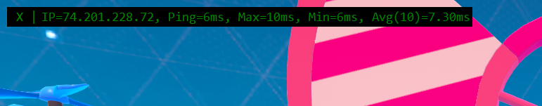

# Fall Guys Ping Estimate

Reads the IP address of the Fall Guys Server from the player logs. Then directly pings the Fall Guys Server every 5 seconds and presents the stats in an overlay

This is different from other Fall Guys stats collectors which read the ping from the logs. The problem with that approach is the ping is not updated very often in the logs, and the value appears to be more than just an RTT ping, for example it could include processing time on the server, or it could be rounded up to specific numbers. In my experince the ping number in the player logs can not be trusted.

## Screenshot



## Download and Run Executable

If you want a one click executable file, no need to worry about the source code or anything, download and run here (first time you download Windows Defender will need ~10 seconds to scan the file and you may get a warning where you need to click "More info" -> "Run Anyway"): https://github.com/notatallshaw/fall_guys_ping_estimate/releases/download/v0.5.1/run_fgpe.exe

## Shutdown

Press the X at the leftmost section of the overlay

## Collect Stats

You can find statistics of all your Fall Guys sessions by opening File Explorer and pasting in the address bar: `%APPDATA%\fgpe`

In here you will find a file named `stats.csv` which you can open with Excel or import in to Google Sheets or many other tools / programming languages

## Report Unknown Region / Location

Because the region and location is built manually there will likely be many ip addresses where the region and location are not known. You will see something like this:


Please take the following steps:

1. Open a New Issue: https://github.com/notatallshaw/fall_guys_ping_estimate/issues/new
2. Put in what details you can, especiailly if you know your Fall Guys Region
3. Open File Explorer and paste in the address bar `%APPDATA%\fgpe` and press enter
4. Drag the file "unknown_ip_addresses.csv" in to the new issues box
5. Press "Submit new issue"

## Install from Source Code

To install you must have Python 3.9+ and run the following command:

```
python -m pip install git+https://github.com/notatallshaw/fall_guys_ping_estimate.git
```

## Run from Source code

On the command line run:

```
python -m fgpe
```

## Build Executable

Checkout the source code from git, have Python 3.9+ installed.

Install the package in the git repository:

```
python -m pip install .
```

Install Pyinstaller:

```
python -m pip install pyinstaller
```

Build the installer (will create an exe at dist\run_fgpe.exe):

```
pyinstaller installer\run_fgpe.py --clean --add-data "fgpe/data/*;fgpe/data" --noconsole --onefile --icon installer\fall_guy.ico
```


## Icon File

The excellent icon file for the executable was created by "Foxpool": https://pixabay.com/users/foxpool-19974991/

It is listed as "Free for commercial use. No attribution required" and is sourced at: https://pixabay.com/illustrations/fall-guys-fall-guy-guy-6022164/
